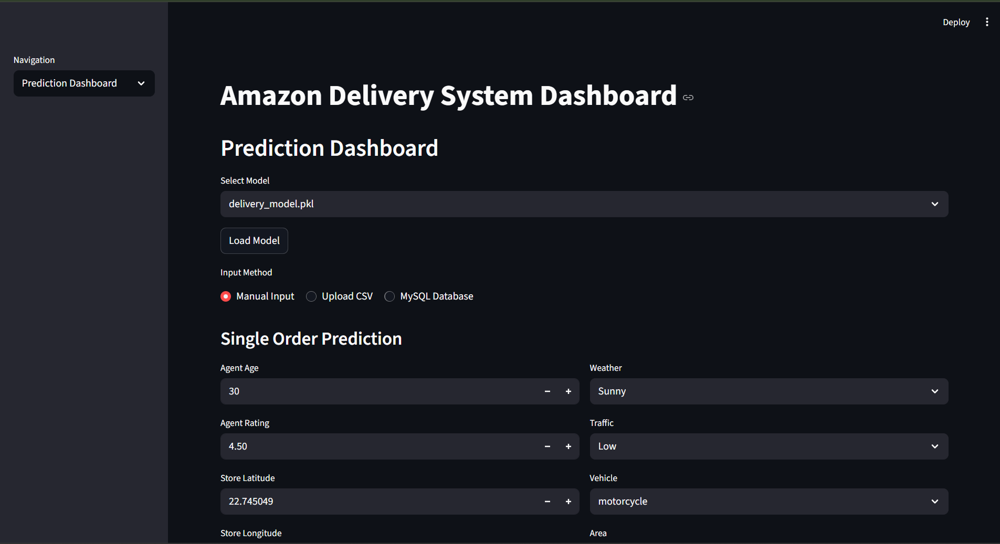
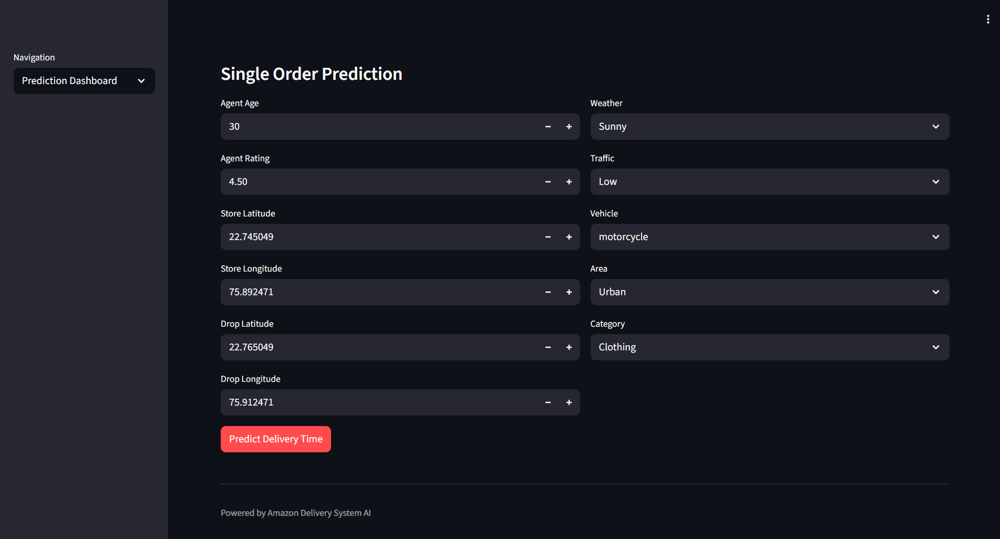
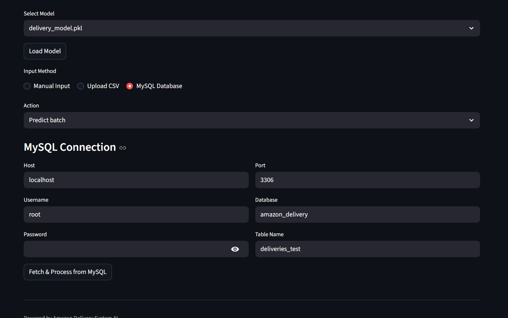
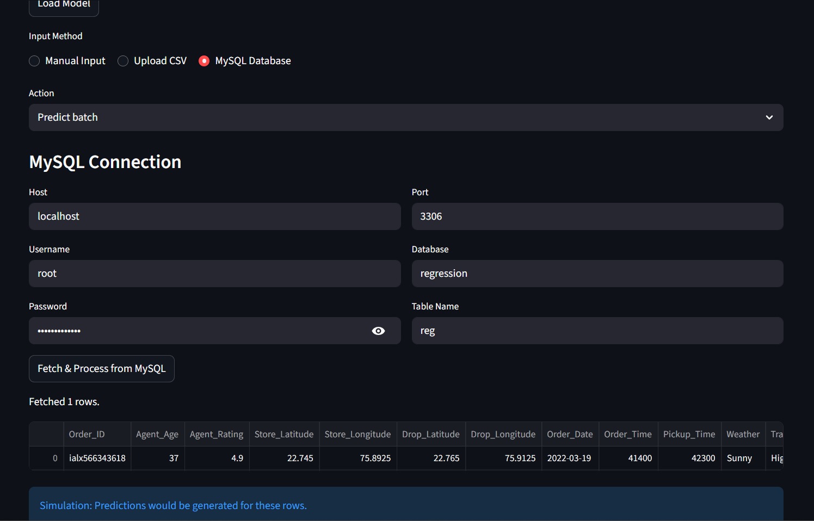

# Amazon Delivery Time Prediction System

## 📖 Project Overview
This project is an end-to-end Machine Learning pipeline designed to predict the **estimated time of delivery** for Amazon orders based on various logistical factors. Unlike simple estimation methods, this system utilizes advanced regression techniques—including ensemble stacking—to analyze historical data (delivery person age, ratings, location coordinates, traffic density, and weather conditions) and forecast precise delivery times.

The project follows a standard ML lifecycle: **Data Ingestion → Preprocessing → Model Training → Evaluation → Deployment**.

## 📊 Workflow Architecture
1. **Data Ingestion:** Loads the `Amazon_delivery_time.csv` dataset containing delivery logs.
2. **Preprocessing:**
   - **Handling Missing Values:** Imputation strategies for null values.
   - **Feature Engineering:** Calculating the distance between the restaurant and delivery location using the Haversine formula.
   - **Encoding:** One-Hot Encoding for categorical data (e.g., Weather, Traffic).
   - **Scaling:** Standardizing numerical features using Scikit-Learn Pipelines.
3. **Modeling:**
   - **Linear & Ridge Regression:** Baseline linear models.
   - **Random Forest & XGBoost:** Advanced tree-based ensemble models.
   - **Stacked Regressor:** A meta-learner that combines the predictions of the previous models to improve overall accuracy.
4. **Deployment:** A web-based user interface built with **Streamlit** that takes delivery parameters and predicts the time in minutes.

## 📈 Model Evaluation
The models were trained and evaluated on the industrial dataset. The **Stacked Regressor** emerged as the best performing model.

| Metric | Linear Reg. | Ridge Reg. | Random Forest | XGBoost | Stacked Regressor |
| :--- | :--- | :--- | :--- | :--- | :--- |
| **RMSE** | 33.3036 | 33.3042 | 23.1124 | 22.1654 | **21.9526** |
| **MAE** | 26.3118 | 26.3116 | 17.6397 | 17.1974 | **16.9792** |
| **R² Score** | 0.5782 | 0.5782 | 0.7969 | 0.8132 | **0.8167** |
| **Adj. R²** | 0.5779 | 0.5778 | 0.7967 | 0.8130 | **0.8166** |
| **MAPE** | 27.96% | 27.96% | 16.16% | 15.94% | **15.67%** |

> **Key Observation:**
> * The **Stacked Regressor** is the **Champion Model**, achieving the lowest Error (RMSE: 21.95) and the highest R² Score (0.8167).
> * By combining the strengths of Random Forest and XGBoost, the Stacked model squeezed out extra performance, reducing the average error to under **17 minutes** (MAE).
> * Linear models failed to capture the complexity of traffic and weather patterns (R² ~0.58), validating the need for complex ensemble architectures.

## 🛠️ Tech Stack
* **Language:** Python
* **Data Manipulation:** Pandas, NumPy
* **Machine Learning:** Scikit-Learn (Linear, Ridge, RF, StackingRegressor), XGBoost
* **Web Interface:** Streamlit
* **Utils:** Pickle (for model serialization)

## 📂 Project Structure
```text
├── app/
│   ├── __pycache__/
│   ├── frontend.py          # Streamlit / UI logic
│   └── main.py              # Main application entry point
│
├── images/
│
├── data/
│   ├── processed/           # Cleaned and preprocessed datasets
│   └── raw/                 # Original input datasets
│
├── models/
│   ├── delivery_model.pkl               # Final delivery time prediction model
│   ├── linear_regression_model.pkl      # Linear Regression model
│   ├── my_random_forest_model.pkl       # Random Forest model
│   ├── my_ridge_regression_model.pkl    # Ridge Regression model
│   └── my_stack_regression_model.pkl    # Stacking / Ensemble model
│
├── src/
│   ├── generate_addresses.py  # Utility to generate synthetic location/address data
│   ├── inference.py           # Inference pipeline for predictions
│   ├── model.py               # Model creation, training helpers
│   ├── preprocessing.py       # Feature engineering & preprocessing steps
│   └── train.py               # Script to train and save ML models
│
├── .gitattributes             # LFS / Git config for large files
├── .gitignore                 # Ignore rules for unnecessary files
├── hcltech.ipynb              # Jupyter notebook (EDA / experimentation)
├── README.md                  # Project documentation
└── requirements.txt           # Python dependencies
```

## 📊 Dashboard Preview





